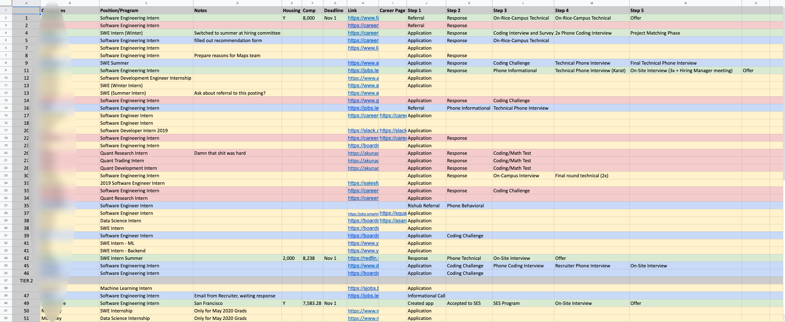
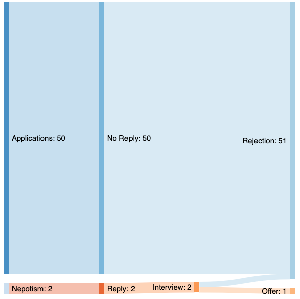

I was inspired by [this Reddit post](https://www.reddit.com/r/cscareerquestions/comments/9ose8m/an_internship_search_visualized/) about visualizing the internship search. 

So as I graduate next semester, I thought it would be cool to look back on the data behind the past few years of painful job searching.

This post might come off as douchebaggery. I get that. I understand talking about this contributes to a sort of toxic environment in an already ultra-competitive group of college students.

But I also think more people should be open about their process. I think there's value in reducing the stigma behind talking about job opportunities, especially if it's for advice that's informative and actionable.

And while to some it might seem that I went through a lot, just take a peek at r/cscareerquestions, and you'll find way crazier accounts of what it takes to find a job.

Anyways, let's get to the data.

*P.S. These "Sankey" diagrams are built using [Sankeymatic](http://sankeymatic.com/build/).*

### Summer 2018 Internship (Freshman Year):

Nepotism meaning my dad helped me find the opportunity through one of his clients. I ended up working at a [tiny Chinese startup](https://www.sihuatech.com/) in the Bay Area where I lived.

### Summer 2019 Internship (Sophomore Year):

The single offer came from JPMorgan Chase. I'm not sure I would have gotten the offer if I hadn't gone to their [Code for Good hackathon](https://www.jpmorgan.com/insights/technology?source=cib_pa_gd_techforsocialgoodb0720).

### Summer 2020 Internship (Junior Year):

.png)

This year is when I really grinded LeetCode, at around 120+ problems. I also studied for interviews intensively with a friend.

### New Grad 2021 (Senior Year):

I got lazy, and didn't study for interviews at all this year. Backfired a bit.

### Regret

It pains me to look back on my college years and see how much time and effort I spent trying to find a damn job.

Yes, I got my dream job, but at what cost?

For two years, my entire sense of self-worth was tied to the prestige of the company that I could work for.

I stopped picking up the phone when my mom called.

I stopped going out with my friends on weekends.

I stopped going to basketball games and practices.

And to what end? To grind Leetcode? To sit at my desk, scrolling mindlessly through more job boards? To continue building side projects not because I thought they were cool, but because I though they would look good on my resume? To go to hackathons for similar reasons?

Being so consumed by jobs was probably my #1 regret from college. And a distant second and third are getting more involved in research and studying abroad.

### How did this happen?

How did I become so damn consumed? 

How did internships take over my life?

I think it was a few things.

1. **I wanted to impress my peers.**

    *Seeing my peers get jobs I wanted made me sad. I've got a big fat ego. Many nights I would literally cry over this. It's so toxic that their success meant my failure. Truth is, everyone is so worried about themselves that they don't have time to judge others. I needed to [stop giving a fuck](https://jonathancai.com/how-to-not-give-a-fuck/) about what my friends thought of me.*

2. **I wanted to impress my parents.** 

    *They're asian, so obviously they care quite a bit about jobs and job security. When they talk with friends about their children, all that they really need to know about them is 1. what school they went to and 2. what job they have. Truth is, my parents would love me no matter what job I had. They wouldn't treat me any differently if I had ended up at a second tier company, or even if I didn't find a job at all. Again, I needed to [stop giving a fuck](https://jonathancai.com/how-to-not-give-a-fuck/) about what my parents thought of me.*

3. **I'm naturally an obsessive kind of guy.** 

    *Once I put my head down and focus on something, it's hard for me to take the blinders off. Best way to work past this, I've realized is through better habits. James Clear's Atomic Habits made this abundantly clear to me. I'm still working on this today.*

### Privilege

You could probably say: "Yeah you put in some work, but you're just privileged and lucky that you got your dream job. You're only regretting it now that you got what you wanted".

And I think you would largely be right.

But at the same time I believe I could've reached the same outcomes without sacrificing so much of my mental health, college life, and relationships.

### Takeaways

1. **It's a numbers game.**

    Everyone says this, but it's still hard to not take things personally.

2. **If you're having problems, diagnose well.**

    If you're struggling to get interviews, your resume might need some more work. If you're struggling to pass coding interviews, you might need to do some more LeetCode. It's easy to jump to false conclusions when you receive many rejections. The worst assumption of all being that you're not a successful human being.

3. **Use referrals.**

    I was too lazy to add this data into the diagrams, but there was a much higher success rate when someone within my network at gave me a referral to the company.

4. **Don't write cover letters.**

    Some still write them, but no one reads them. I wrote them my freshman year because I was desperate, but clearly it didn't do me much good.

5. **Live life.** 

    It's corny, I know, but jobs come and go but you only have one family, one college experience, and one life. A dream job isn't worth it if it's at the expense of so much.

If you've gotten this far, you're probably a college student going through this right now. If so, read Takeaway #4 again. Seriously. And feel free to reach out to me at caimjonathan@gmail.com if you want another set of eyes on your resume or any other kind of advice. Especially if you're a fellow Rice student ;)
